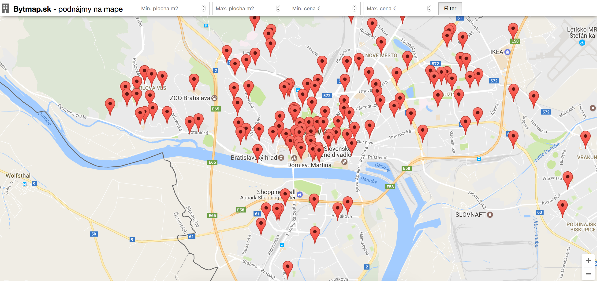

## [Bytmap.sk](https://bytmap.sk)
Visualizing rental apartments in Slovakia on a map.

### Server
A crawler written in Scala to crawl rentals periodically from [topreality.sk](https://www.topreality.sk/). It uses google API to resolve geolocation from address and saves the results into ElasticSearch.
### Lambda
An AWS lambda function to read rentals from ElasicSearch within given geolocations with filters for price and area.
### Static pages
The frontend of the application, reading rentals from lambda and showing them on a map.
